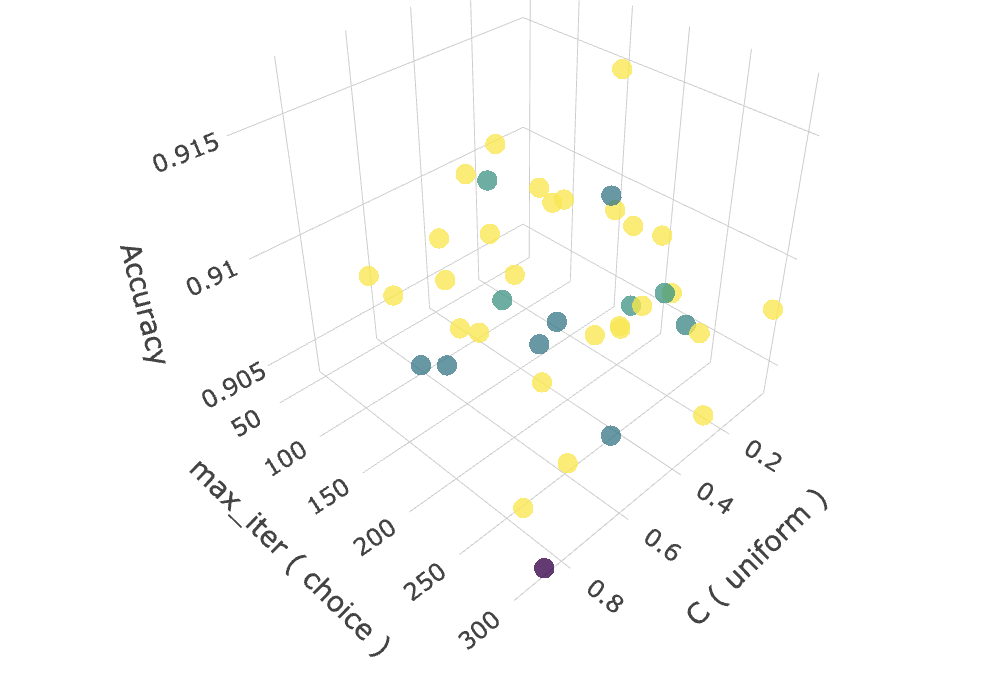
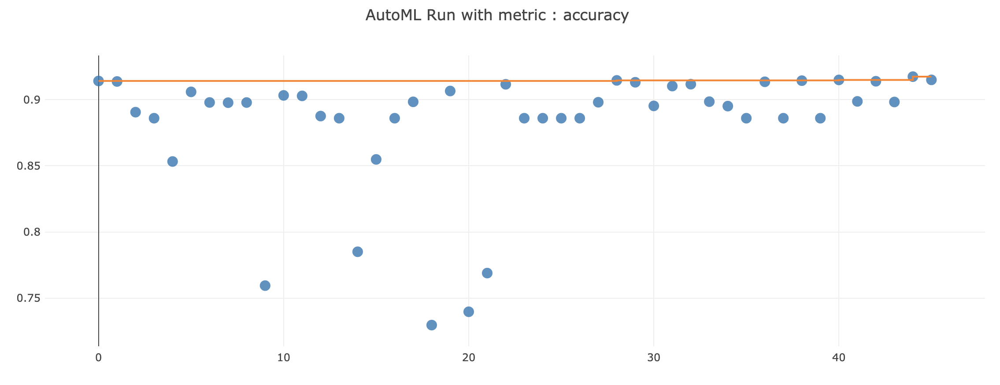
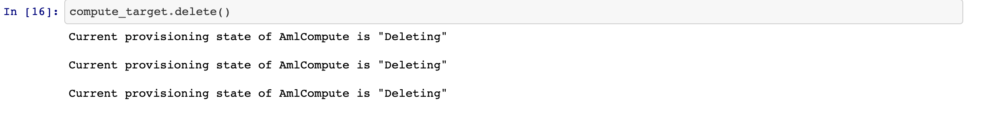

# Optimizing an ML Pipeline in Azure

## Overview
This project is part of the Udacity Azure ML Nanodegree.
In this project, we build and optimize an Azure ML pipeline using the Python SDK and a provided Scikit-learn model.
This model is then compared to an Azure AutoML run.

## Summary
### Problem Statement
The project main goal is to accurately predict(classify) the clients that will subscribe to a term deposit and those that would not. The dataset used for this project is the `Bank Marketing Dataset` from the UCI machine learning repository. 

### Solution
The solution is to build a machine learning model using two difference approaches. One of the appraoch is using the `Microsoft azure hyperdrive` which gave an accuracy of 91.67%. The second approach was using the `Microsoft AutoML` which gave an accuracy of 91.74%. The best performing model was a Voting ensemble moddel which was produced by the AutoML approach.

## Scikit-learn Pipeline
**Explain the pipeline architecture, including data, hyperparameter tuning, and classification algorithm.**
The data is loaded, preprocessed (which includes one hot encoding, binary encoding of categorical features, parsing of the dates) and splitted in the [train.py file](train.py). The [training script](train.py) is the entry point for the SKLearn esitmator which is fed intot the configuration of the hyperdrive. The Hyperdrive then runs with the aim of maximising the accuracy of the model after being passed with various algorithm parameters (mainly `C` and `max_iter`) to vary from.

**What are the benefits of the parameter sampler you chose?**
`RandomSampler` is used because it is not computationally expensive, hence we can hasten the exploration of the parameter space. 

**What are the benefits of the early stopping policy you chose?**
`BanditPolicy` helps to know the minimun required improved needed to continue with the parameter search. It uses the slack factor which defines how far off the primary metric of a run must be from the best performing run's for it to be terminated.

## AutoML
**In 1-2 sentences, describe the model and hyperparameters generated by AutoML.**
The AutoML is set to have 5 cross validations and it runs 100 iterations and takes in maximum of eight concurrent runs at a time. the target column and the data is also passed into the configuration of the AutoML. The best model generated by the AutoML is the `VotingEnsemble` model

## Pipeline comparison
**Compare the two models and their performance. What are the differences in accuracy? In architecture? If there was a difference, why do you think there was one?**
The AutoML model had an accuracy of about 0.9174 compared to a model accuracy of 0.9167. the difference in both models accuracy are quite insignificant. 
The architecture of both models were kind of different. For the hyperdrive model the data was cleaned and then pass into the a logistic regression model and then into the hyperdrive for model tuning whereas in the AutoML model, the cleaned data is just passed into the AutoML configuration and hence the AutoML could explore other algorithms to train the dataset and even perform some other approaches like stacking and ensembling the algorithms.

## Future work
**What are some areas of improvement for future experiments? Why might these improvements help the model?**
In the future, one of the things to be included into the whole pipeline would be handling imbalanced data as this could be one of the cause of the model's very high accuracy. 
Also, the data cleaning and feature generation or interaction pipeline should be separate from the training pipeline as feature generation and interaction takes a lot of experimentation.

## Proof of cluster clean up
**If you did not delete your compute cluster in the code, please complete this section. Otherwise, delete this section.**

